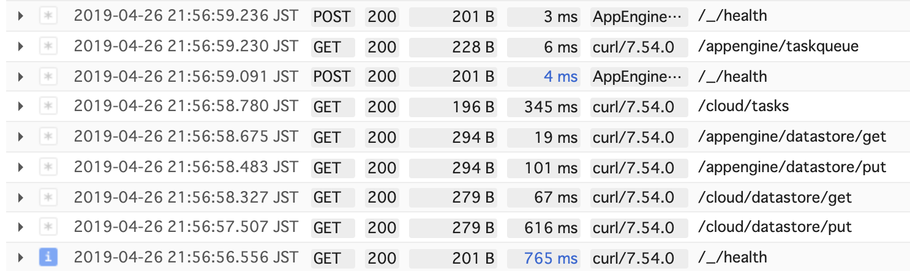
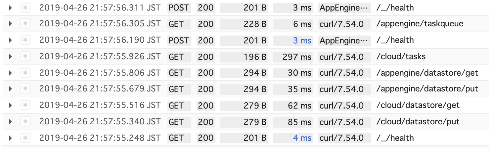
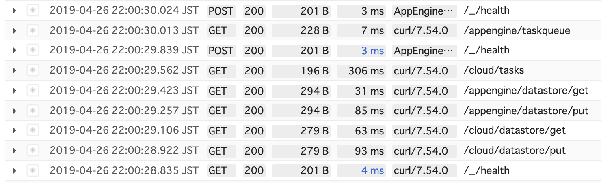

# appengine-speedtest

## Usage

```
export proj=[YOURPROJECT]

$ gcloud projects create ${proj}
$ gcloud services enable cloudtasks.googleapis.com
$ gcloud config set project ${proj}
$ make deploy

$ make curl
```

## Speed test result

 asia-northeast
 





